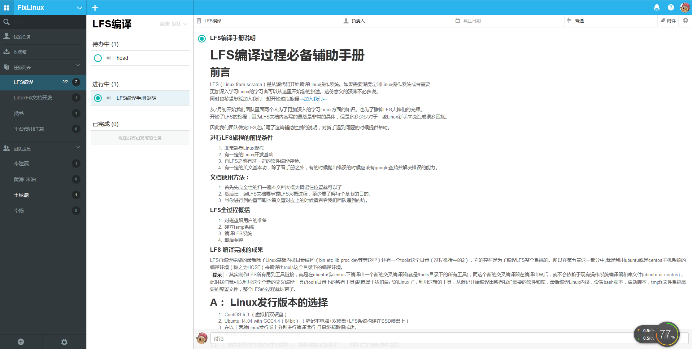

风车样式修改
=================

用了好长时间一段风车

发现左右分栏位置让我十分不满。
这个脚本中除了修改分栏位置

还修改了部分CSS样式让MarkDown看起来能更舒服一点。

使用方法
-----------------------
Firefox 安装 Greasemonkey 插件

添加user script 
选从剪切板添加
复制github上的脚本进去即可

效果图
----------------------------

